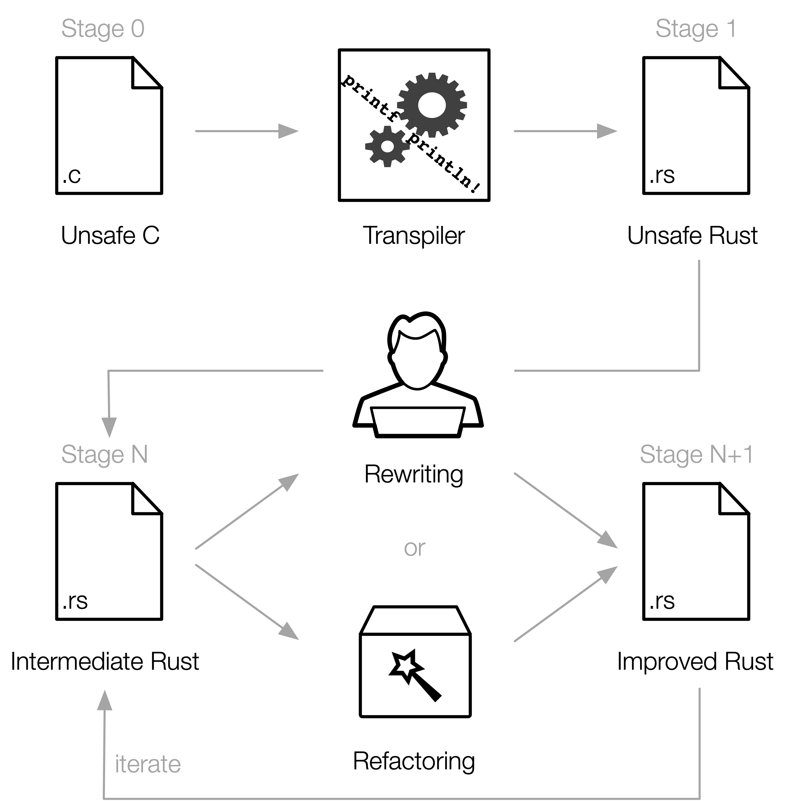

# 毕设第十周周报（3月12日）

## 本周工作

使用AI“翻译”C语言工程为rust工程时存在的困难：

* 项目过大，虽然没有超出输入和输出的窗口极限，但是实际测试没有AI有能力翻译这个大小的工程，单次有效的处理至多处理总体量的十分之一，超出此范围则很容易面临幻觉、纯粹的错误、代码高度混乱等结果。
* 如果拆分翻译，很容易不同部分的翻译结果不协同，代码混乱无法耦合。

首先尝试使用[c2rust](https://github.com/immunant/c2rust)进行翻译，它不是基于AI的翻译工具，翻译结果的可用性具有保证，工作流如下：




然后再用AI完成其中Rewriting等需要人工参与的部分。

但是实际做了跑完流程以后发现，`c2rust`的翻译效果不尽如人意，例如：

```c
static int lfs_bd_erase(lfs_t *lfs, lfs_block_t block) {
    LFS_ASSERT(block < lfs->block_count);
    int err = lfs->cfg->erase(lfs->cfg, block);
    LFS_ASSERT(err <= 0);
    return err;
}
```

此函数的翻译结果是

```rust
unsafe extern "C" fn lfs_bd_erase(
    mut lfs: *mut lfs_t,
    mut block: lfs_block_t,
) -> libc::c_int {
    if block < (*lfs).block_count {} else {
        __assert_fail(
            b"block < lfs->block_count\0" as *const u8 as *const libc::c_char,
            b"/home/duanjr/tctr/littlefs/lfs.c\0" as *const u8 as *const libc::c_char,
            276 as libc::c_int as libc::c_uint,
            (*::core::mem::transmute::<
                &[u8; 39],
                &[libc::c_char; 39],
            >(b"int lfs_bd_erase(lfs_t *, lfs_block_t)\0"))
                .as_ptr(),
        );
    }
    'c_8255: {
        if block < (*lfs).block_count {} else {
            __assert_fail(
                b"block < lfs->block_count\0" as *const u8 as *const libc::c_char,
                b"/home/duanjr/tctr/littlefs/lfs.c\0" as *const u8
                    as *const libc::c_char,
                276 as libc::c_int as libc::c_uint,
                (*::core::mem::transmute::<
                    &[u8; 39],
                    &[libc::c_char; 39],
                >(b"int lfs_bd_erase(lfs_t *, lfs_block_t)\0"))
                    .as_ptr(),
            );
        }
    };
    let mut err: libc::c_int = ((*(*lfs).cfg).erase)
        .expect("non-null function pointer")((*lfs).cfg, block);
    if err <= 0 as libc::c_int {} else {
        __assert_fail(
            b"err <= 0\0" as *const u8 as *const libc::c_char,
            b"/home/duanjr/tctr/littlefs/lfs.c\0" as *const u8 as *const libc::c_char,
            278 as libc::c_int as libc::c_uint,
            (*::core::mem::transmute::<
                &[u8; 39],
                &[libc::c_char; 39],
            >(b"int lfs_bd_erase(lfs_t *, lfs_block_t)\0"))
                .as_ptr(),
        );
    }
    'c_8218: {
        if err <= 0 as libc::c_int {} else {
            __assert_fail(
                b"err <= 0\0" as *const u8 as *const libc::c_char,
                b"/home/duanjr/tctr/littlefs/lfs.c\0" as *const u8
                    as *const libc::c_char,
                278 as libc::c_int as libc::c_uint,
                (*::core::mem::transmute::<
                    &[u8; 39],
                    &[libc::c_char; 39],
                >(b"int lfs_bd_erase(lfs_t *, lfs_block_t)\0"))
                    .as_ptr(),
            );
        }
    };
    return err;
}
```

让ai来简化长这样的函数到rust原生实现也实在有些难为AI了。

进而选择新的路径是：
将公用的结构体、枚举、宏等信息手动调用AI翻译并确保结果正确。然后再要求AI翻译每个函数时传入这些公用信息。调用脚本并完成了全部的翻译，结果见[此commit](https://github.com/duanjr/littlefs-rust/commit/54c701ddc7ebbccab3b6237b567657287836eb1e)。

## 下周工作

修复目前存在的故障，使现有代码能够无故障运行，具备`littlefs`的各项功能。
